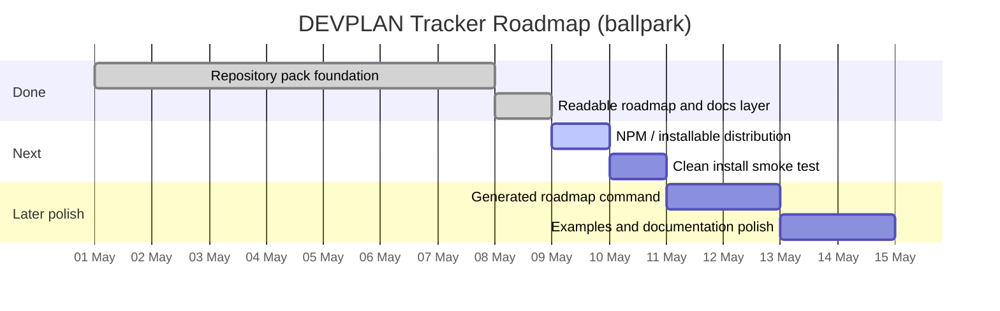

# DEVPLAN Human Roadmap

_Last updated: 2026-05-08_

This is the quick-read layer for humans. `devplan/DEVPLAN-STATE.json` remains the machine source of truth. `devplan/DEVPLAN.md` remains the narrative development plan. This file exists so maintainers, clients, and agents can see status, sequence, ballpark timescales, and likely automation effort without reading the JSON state file.

## Status marker legend

| Marker | Meaning | Use |
| --- | --- | --- |
| 🟢 Done | Complete and evidenced | No action unless regression appears. |
| 🔵 In progress | Currently being worked | Continue or review the active branch/PR. |
| 🟡 Planned next | Next sensible work | Ready to pick up when prerequisites exist. |
| 🟠 At risk / blocked | Needs a decision, credential, dependency, or external system | Resolve the blocker before spending more agent runs. |
| ⚪ Later / polish | Useful but not release-blocking | Schedule only after the core release path is stable. |
| 🧭 Roadmap | Sequenced delivery lane | Used for timing and dependency context. |
| 🤖 Agent effort | Rough Codex / Claude Code workload | Planning estimate only, not a billing or quota guarantee. |

## Effort scale

| Size | Typical scope | Automation estimate |
| --- | --- | --- |
| XS | Documentation tweak, copy edit, metadata update | <1 Codex run. |
| S | Focused file change or small docs/code addition | 1 Codex run. |
| M | Several files, tests, and review loop | 2-3 Codex runs or up to 1 Claude Code quota-heavy session. |
| L | Cross-cutting feature, migration, or release workflow | 4-6 Codex runs or 1-2 Claude Code quota-heavy sessions. |
| XL | Multi-sprint product feature | Needs its own DEVPLAN milestone before work starts. |

## Current snapshot

Progress: 🟩🟩🟩🟩🟩🟩🟩🟩⬜⬜⬜ 8 / 11 tracked delivery items done.

| Marker | Workstream | State | Ballpark timescale | Effort | Confidence | Next action |
| --- | --- | --- | --- | --- | --- | --- |
| 🟢 | Repository pack foundation | Done | Complete as of 2026-05-08 | Already spent | High | Keep existing CLI, schema, installer, tests, and CI stable. |
| 🟢 | Readable roadmap and docs layer | Done | Complete as of 2026-05-08 | XS-S | High | Keep this file aligned whenever tracked work changes. |
| 🟡 | NPM / installable distribution readiness | Planned next | 0.5-1 day once credentials and package naming are confirmed | S: 1 Codex run + human npm auth | Medium | Confirm package destination, publish or document install path, then record evidence. |
| 🟡 | Clean install smoke test | Planned next | 0.5-1 day after distribution path is confirmed | S: 1 Codex run | Medium | Install into a clean throwaway repo and validate default commands. |
| ⚪ | Generated roadmap command | Later polish | 1-2 days after release-critical work is closed | S-M: 1-2 Codex runs, unlikely to need a full Claude Code quota | Medium | Add a CLI/report mode that can regenerate this readable roadmap from state. |

## Roadmap lanes

## Milestone view

### 🟢 repo-pack — Standalone repository pack

The core repository pack is functionally complete. It includes repository structure, CLI commands, installer safety, validation coverage, CI tests, `/devplan` default layout, examples, and documentation. Remaining work is not about whether the pack exists; it is about making distribution and ongoing usage clearer.

### 🟡 release-distribution — Installable release path

This is the next release-risk area. The package needs a verified install route that a user can follow without reading internal repo history. If npm credentials, package naming, or release metadata are unavailable, this becomes a human-gated blocker rather than a coding problem.

Estimated effort: S. Expected path is one Codex pass plus a human npm/auth decision. Probability of finishing in a single focused session is high if credentials and naming are already settled; probability drops to medium if npm publication decisions are still open.

### ⚪ roadmap-automation — Generated readable roadmap

The manual roadmap is useful immediately, but long-term it should not drift from `DEVPLAN-STATE.json`. A future CLI command should generate a refreshed human roadmap or report section from the state file, using the same marker and effort conventions.

Estimated effort: S-M. Expected path is one or two Codex passes. A full Claude Code quota-heavy session is unlikely unless generation is expanded into templates, config, tests, and installer changes all at once.

## How to read this file

Use this file first when deciding what to do next. Use `devplan/DEVPLAN-STATE.json` when an agent or script needs exact state. Use `devplan/DEVPLAN.md` when the project needs a narrative explanation of why the work exists. If the three files disagree, update them in the same PR and treat the JSON state as the canonical tracker until validation passes.
